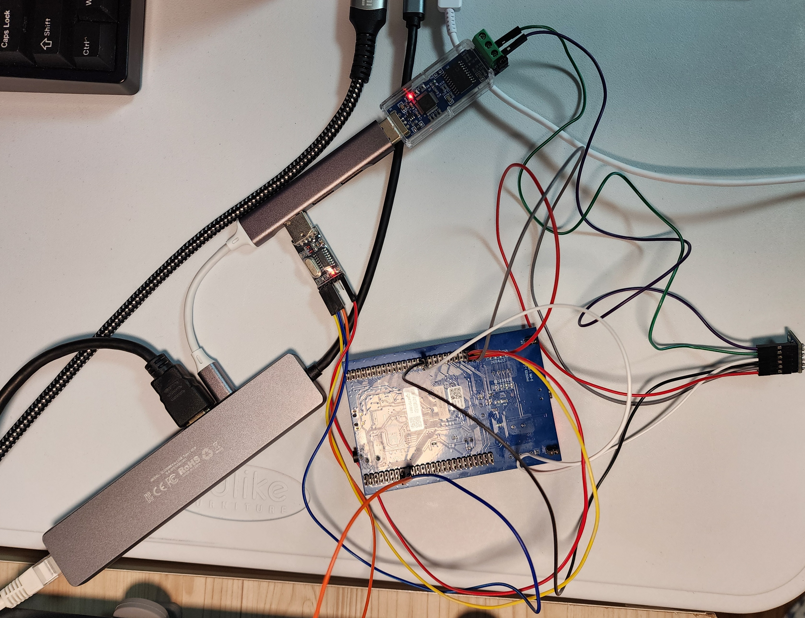
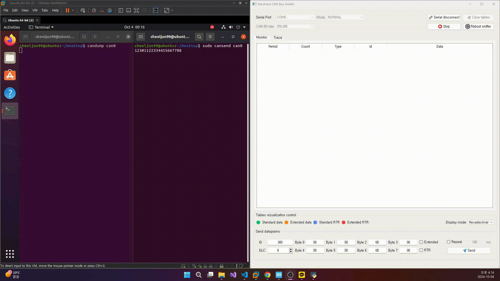
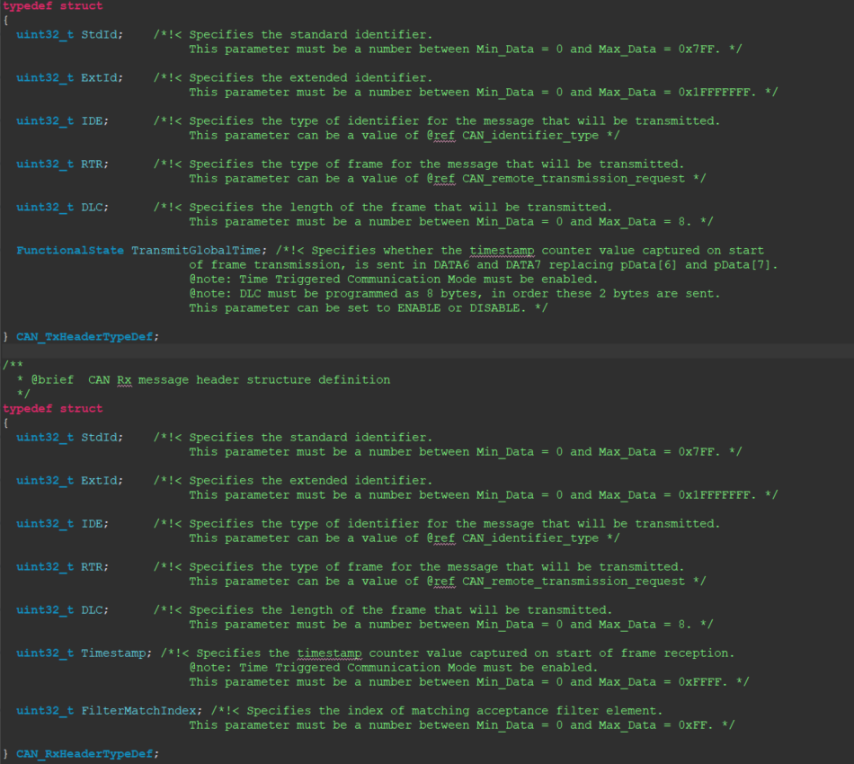

## STM32F407VGT6_CAN_Sniffer_NonRTOS

## Referrence
https://github.com/JorgeMaker/CanSnifferSuite

## 사용장비
1. 아두이노 SN65HVD230 CAN BUS 송수신 모듈
2. 아두이노 CH340G USB to TTL 모듈
3. STM32F407G-DISC1 보드 STM32F407VGT6 MCU
4. USB to CAN 통신 분석기

## 선로구성

## 환경설정

*나머지는 STM32F407VGT6_CAN_Sniffer_NonRTOS.ioc 참조

## 결과

## 회고
1. STM32F407G-DISC1 보드의 경우 TTL to USB 와 보드의 연결에 있어서 3.3V가 아닌 5V로 연결해야지 마이크로 USB 연결 없이도 전력을 정상적으로 공급할 수 있음
2. LED로 디버깅을 할 때는 HAL_GPIO_WritePin함수 사이에 HAL_Delay함수를 쓰면 동작이 제대로 되지가 않는 문제가 발생 추측 상 delay 동안 여러 타임아웃으로 처리되는 로직들에 문제가 발생하여 제대로 된 동작을 할 수 없는 것이라고 생각됨 그래서 대안으로 HAL_GPIO_TogglePin함수를 써야할 듯
3. MCU에 전달되는 CAN 데이터의 형식이 어떻게 되는지는 아래의 사진을 통해 알 수 있음(RX 수신 데이터 형식, TX 송신 데이터 형식)
