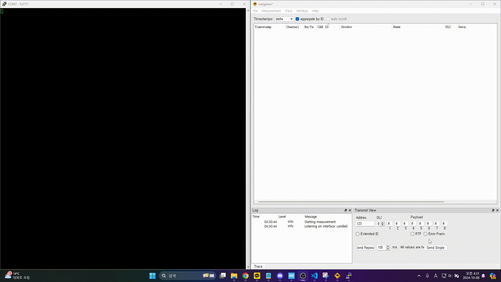

## STM32F407VGT6_CAN_Sniffer_Only_Received_RTOS

## 사용장비
1. 아두이노 SN65HVD230 CAN BUS 송수신 모듈
2. 아두이노 CH340G USB to TTL 모듈
3. STM32F407G-DISC1 보드 STM32F407VGT6 MCU
4. USB to CAN 통신 분석기
5. putty

## 환경설정

*STM32F407VGT6_CAN_Sniffer_Only_Received_RTOS.ioc 참조

## 결과

## 회고
본 프로젝트는 FreeRTOS를 이해를 바탕으로 CAN Sniffer를 RTOS로 구현한 프로젝트이며 오직 수신 기능만을 구현한 프로젝트이다.

위 그림이 RTOS 시스템의 작동흐름을 보여주는 블록 다이어그램으로 동작 원리는 다음과 같다.

1. CAN 데이터가 수신될 시 ISR을 통해 실행중인 Task를 대기상태로 전환하고 CAN 데이터를 큐에 넣기 위한 형식으로 전처리한다.
2. 전처리한 CAN 데이터를 큐에 넣는 T1 Task를 실행하여 큐에 넣는 작업을 진행한다.
3. DatagramsQueue에 CAN 데이터가 들어오게 되면 큐에서 빼내는 T2 Task를 실행하게된다.
4. 해당 두 Task의 우선순위의 경우 같은 우선순위를 가지므로 라운드로빈을 통해 먼저 실행하게 되는 T1 Task가 끝나서 대기상태로 전환되면 T2 Task가 동작한다.
5. 해당 두 Task가 일을 끝마치고 대기상태로 들어가면 ISR이 실행되기전에 IDLE Task가 하드웨어 자원을 선점한다. 
6. IDLE Task는 가장 우선순위가 낮은 Task 이므로 ISR 발생하거나 혹은 T1,T2 Task가 실행되면 대기 상태로 전환되며 앞선 Task들의 대기 상태를 기다리게 된다.
7. 생성한 총 3개의 Task는 자신의 할일을 다 마치고 종료하는 것이 아닌 대기상태로 전환되고 자신들을 깨워주는 이벤트를 기다린다.
8. IDLE Task에는 OsDelay를 사용하였는데 OsDelay를 통해 대기상태에 전환되거나 자신보다 높은 우선순위를 가진 Task가 깨어나면 대기상태로 전환한다.
