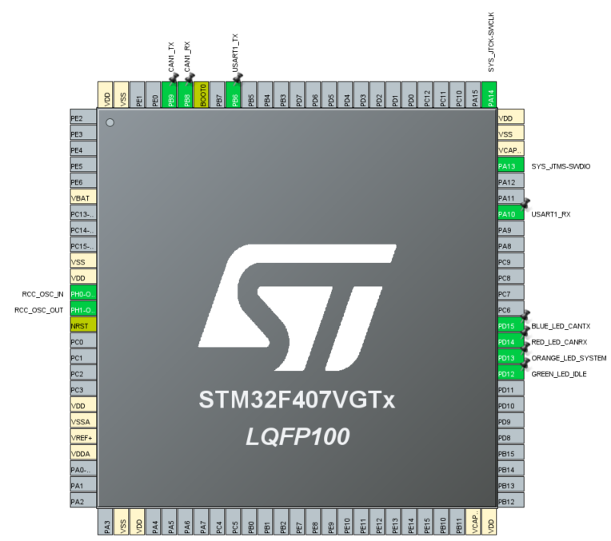
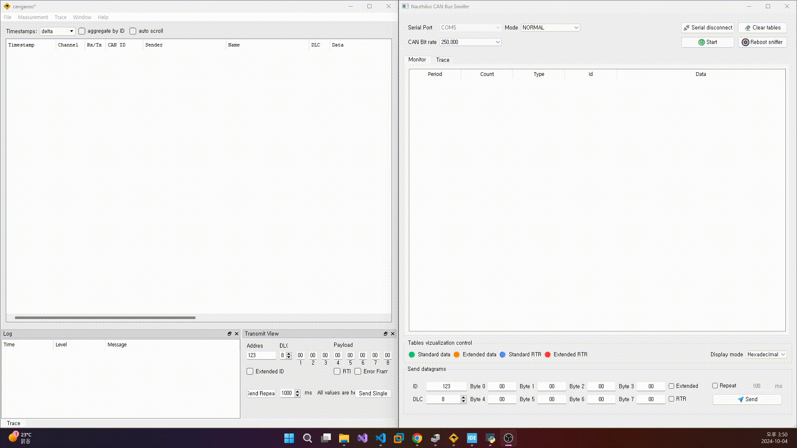
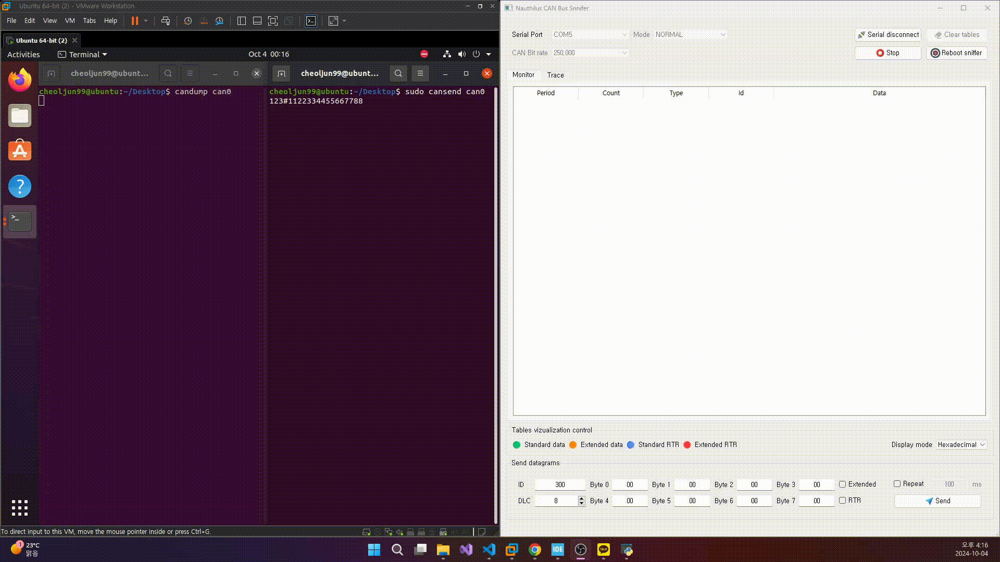
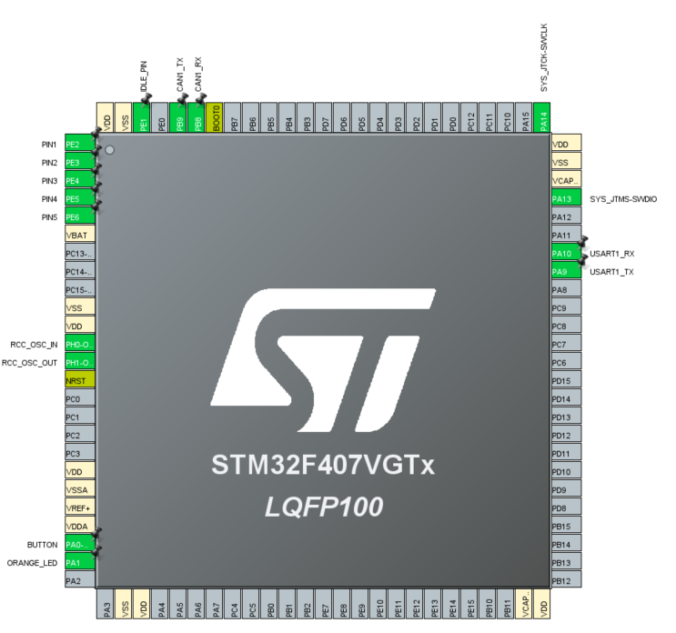

## STM32F407VGT6_CAN_Sniffer_RTOS

## Referrence
https://github.com/JorgeMaker/CanSnifferSuite

## 사용장비
1. 아두이노 SN65HVD230 CAN BUS 송수신 모듈
2. 아두이노 CH340G USB to TTL 모듈
3. STM32F407G-DISC1 보드 STM32F407VGT6 MCU
4. USB to CAN 통신 분석기

## 환경설정

*나머지는 STM32F407VGT6_CAN_Sniffer_RTOS.ioc 참조

## 결과

## 회고
아래는 원본 ioc

사용된 핀 중에서 SYS, RCC, USART, CAN을 제외하면 사용하지 않거나 함수 실행이 제대로 되었는지 확인하는 GPIO로 보드에서 지원하는 LED로 대체가 가능하므로 삭제가 가능하다.

또한  보드 내장 LED의 경우 현재 우리가 사용하는 보드인 STM32F407G-DISC1의 경우에는 PD12 ~ 15까지 지원한다. 

마지막으로 고질적인 문제인 USART1에 데이터가 제대로 저달이 되지 않는 문제가 지속적으로 발생한다.  보드 기준으로 USART1으로 부터 수신(USART1_RX)은 문제가 없다고 판단된다. 이유는 GUI앱에서 보드로 스니퍼 상태 변화를 위한 명령과 CAN 데이터 전송 명령이 USART1을 통해 보드로 잘 전달이 되기 때문이다. 하지만 보드에서 USART1으로 송신(USART1_TX)는 문제가 있다고 판단된다. 이유는 간단한 텍스트 조차 보드에서 전송해도 출력되지 않는다.  때문에 현재의 PA9(USART1_TX)를 대체할 수 있는 핀을 찾아서 그곳으로 역할을 대체한다면 어떻게 될까? 대체 포트는 (현재 포트에 커서를 두고 CRTL + 왼쪽 클릭)을 하면 알 수 있다. 그 결과 정상적으로 송신이 되었다. 결과적으로 STM32F407G-DISC1보드의 PA9번 핀에 문제 있는 것으로 판단된다. 향후 LED와 저항을 통해 테스트 예정.

결과적으로 ioc 구성은 다음과 같다.

결과화면을 통해 정상적으로 동작함을 알 수 있고, 이제 FreeRTOS를 이해하고 해당 오픈소스에 사용된 RTOS 시스템 설계 방식을 이해할 필요성이 있다.