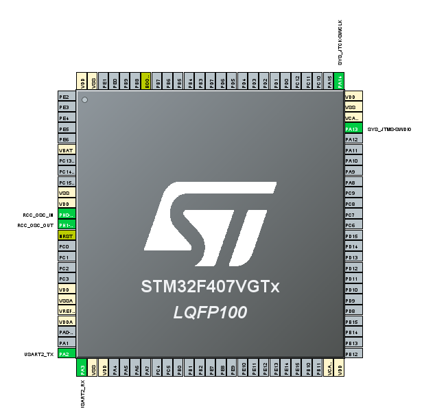
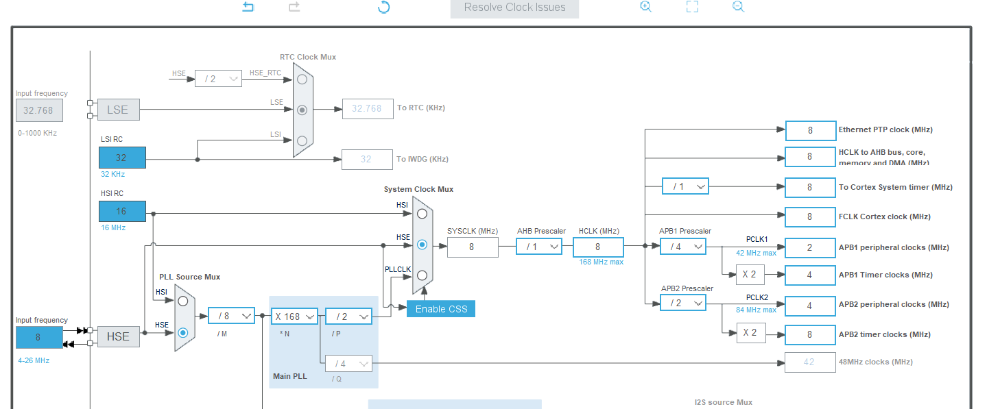
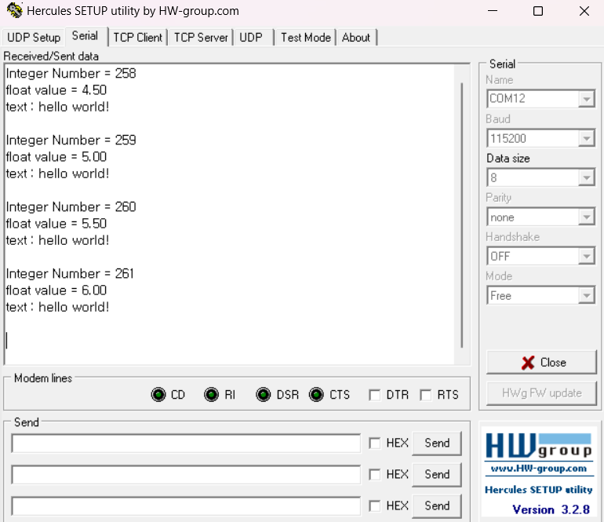

## STM32F407VGT6_UART_Communication

## Referrence
https://github.com/JarrayNizar/UART-stm32f407vgt6

## 환경설정

## 결과

## 회고
STM32F401CCU6에서 설정한 Clock Configurate로 설정해서 진행하였지만 출력값이 원할히 발생하지 않는 문제가 있었음
때문에 Clock Configurate 설정을 MCU 종류에 따라서 올바르게 맞춰주어야 하는 설정값이 존재하는 것 같으며 참고자료 링크의 Clock Configurate를 참고하여 설정하였음
또한 USART의 순서마다 Clock Configurate를 다르게 해주어야하는 것 같음 왜냐하면 해당 깃허브에서는 USART2를 사용하였지만 원래 목표는 USART1을 사용하는 것이 목표이며
참고자료 링크으 Clock Configurate는 USART2만 On으로 하였을시 동작하며 USART1에서는 동작하지 않았다.
다음 목표는 USART1에서 동작시키는 Clock 설정을 해보고자한다.